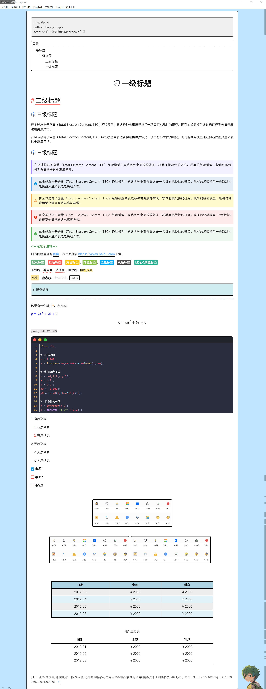

# [Typora](https://typora.io/)
## 使用说明

- ##### Windows

  - 在官网下载安装Typora
  - 安装后，将 `winmm.dll` 复制到安装目录下

### 附加Typora主题(如有需要自行安装)

#### 此项目为Github [Typora-theme-Happysimple](https://github.com/HappySimple/Typora-theme-Happysimple)

